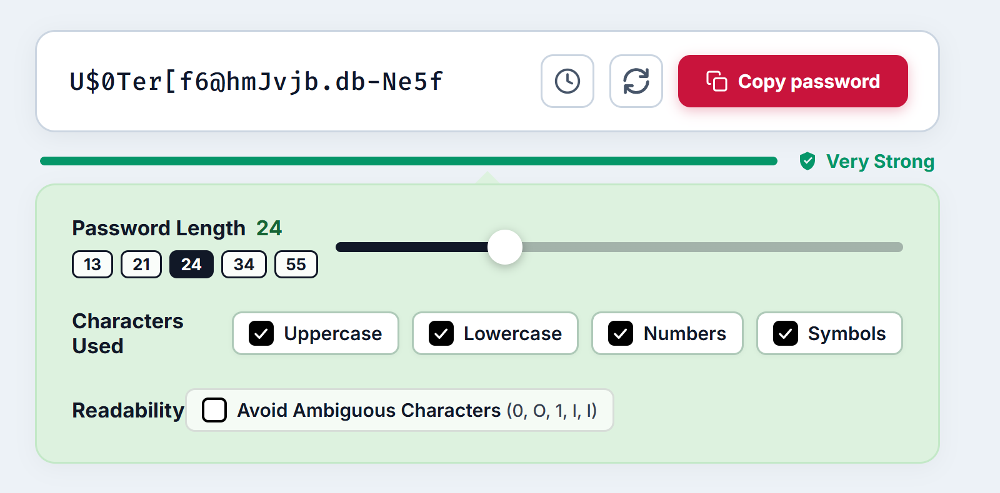

# 🔐 Secure Password Generator

> A fast, beautiful, and cryptographically secure browser extension that creates strong, unbreakable passwords in one click. 100% private, offline, and free forever.

<p align="center">
  
</p>

<p align="center">
  
  
  
  
  
</p>

---

## 🌟 Why Do You Need This?

Reusing simple passwords like `Winter2024!` or `MyDog123` is one of the easiest ways for accounts to get compromised in data leaks. 

**Secure Password Generator** lives right in your browser toolbar, giving you instant access to military-grade, completely randomized passwords whenever you sign up for a new account, reset a login, or secure your accounts.

No sign-ups, no subscriptions, no complicated setup—just open, copy, and stay protected.

---

## ✨ Key Features Built for Everyday Use

- **⚡ Instant 1-Click Copy**: Open the extension and your new password is generated immediately. Click **Copy password** (or click the password text directly) and paste it wherever you need.
- **🛡️ Truly Unpredictable (Cryptographically Secure)**: Uses your browser's built-in `window.crypto` engine rather than basic random number generators, ensuring true entropy that cannot be guessed or brute-forced.
- **🎛️ Easy Length Slider & Quick Presets**: Easily slide between **8 and 64 characters** (default is a strong 24 characters). Need standard lengths fast? Tap any of the quick preset buttons (**13**, **21**, **24**, **34**, or **55**).
- **🔤 Choose Your Character Rules**:
  - **Uppercase** (`A-Z`)
  - **Lowercase** (`a-z`)
  - **Numbers** (`0-9`)
  - **Symbols** (`!@#$%^&*...`)
  *(The generator ensures at least one character from each selected category is always included!)*
- **👁️ "Avoid Ambiguous Characters" Toggle**: Tired of wondering whether a character is an uppercase `O` or a number `0`, or a lowercase `l` versus capital `I`? Check this option to remove confusing look-alikes—perfect for passwords you have to type manually on phones, smart TVs, or game consoles.
- **📊 Real-Time Strength Meter**: See your password strength update live as you change settings, with color-coded feedback and safety ratings (**Weak**, **Fair**, **Good**, **Strong**, **Very Strong**).
- **🕒 Password History Drawer**: Accidentally closed the popup before pasting? Tap the history icon to view and copy your recently generated passwords without breaking a sweat.
- **🔒 100% Private & Works Offline**:
  - **Zero network requests** — nothing is ever transmitted over the web.
  - **Zero tracking or analytics** — no cookies, no telemetry, no third-party scripts.
  - **Your data stays on your machine**.
- **💾 Remembers Your Favorite Settings**: Keeps your preferred length and character choices saved locally so you don't have to reconfigure every time.

---

## 🚀 How to Install (Takes Less Than 1 Minute)

You can easily install this extension on **Google Chrome**, **Brave**, **Microsoft Edge**, or any other Chromium-compatible browser.

### Step 1: Download the Files
1. Click the green **Code** button at the top right of this GitHub page.
2. Select **Download ZIP** and extract the folder anywhere on your computer (e.g., your *Documents* or *Desktop* folder).
   *(Or clone the repository using `git clone https://github.com/jrcramos/password_generator.git`)*

### Step 2: Open Extensions in Your Browser
- In **Google Chrome** or **Brave**: In your address bar, type `chrome://extensions/` and press Enter.
- In **Microsoft Edge**: Type `edge://extensions/` and press Enter.

### Step 3: Turn on Developer Mode
Look in the **top-right corner** of the Extensions page and toggle the **Developer mode** switch to **ON**.

### Step 4: Load the Extension
1. Click the **Load unpacked** button in the top-left corner.
2. In the file picker, select the extracted `password_generator` folder (the folder containing `manifest.json`).
3. That's it! The extension is now installed.

### Step 5: Pin for Easy 1-Click Access
Click the **puzzle piece icon (🧩)** in your browser's top toolbar, find **Secure Password Generator**, and click the **pin icon (📌)** so it is always one click away!

---

## 💡 Best Practices for Password Security

1. **Length is King**: Aim for at least **16 to 24 characters** for primary accounts (email, banking, cloud storage).
2. **Never Reuse Passwords**: Even a 30-character password is risky if used across multiple websites. Always generate a unique password for each account.
3. **Use a Password Manager**: Pair this extension with a password manager (like Bitwarden, 1Password, or your browser's built-in manager) so you never have to memorize complex strings.
4. **Enable Two-Factor Authentication (2FA)**: Whenever available, turn on 2FA (authenticator app or hardware security key) for critical services.

---

## ❓ Frequently Asked Questions (FAQ)

<details>
<summary><b>Is this password generator safe? Can anyone else see my passwords?</b></summary>
<p>Yes, it is 100% safe! The extension operates entirely within your browser locally on your device. It does not have permission to connect to the internet, so it cannot send passwords to external servers or store them anywhere outside your device.</p>
</details>

<details>
<summary><b>Does it work without an internet connection?</b></summary>
<p>Yes! Since the generation logic runs locally using your browser's cryptographic API, you can generate passwords while completely offline or in airplane mode.</p>
</details>

<details>
<summary><b>What does "Avoid Ambiguous Characters" do?</b></summary>
<p>Some fonts make it hard to tell the difference between certain characters (like capital <code>O</code> and digit <code>0</code>, or lowercase <code>l</code>, capital <code>I</code>, and digit <code>1</code>). Enabling this feature filters out these confusing symbols so you can clearly read and type your password anywhere.</p>
</details>

<details>
<summary><b>Is this extension free?</b></summary>
<p>Yes, it is completely free and open source under the MIT License. There are no ads, no trackers, and no premium paywalls.</p>
</details>

---

## 🛠️ For Developers & Technical Details

If you want to inspect or modify the code:

- **Architecture**: Built using standard Web APIs (HTML5, Vanilla CSS, and modern ES6+ JavaScript).
- **Manifest Version**: Manifest V3 compliant.
- **Entropy Engine**: Powered by `window.crypto.getRandomValues()` with Fisher-Yates array shuffling to avoid modular bias.
- **Permissions**:
  - `storage`: Saves user interface preferences and temporary local history.
  - `clipboardWrite`: Allows 1-click copying of generated passwords to your clipboard.

### Project Structure
```text
password_generator/
├── assets/
│   └── screenshot.png     # High-resolution application preview
├── icons/
│   ├── icon-16.png        # Toolbar favicon size
│   ├── icon-32.png        # Windows taskbar & display size
│   ├── icon-48.png        # Chrome extensions manager size
│   └── icon-128.png       # Chrome Web Store & installation size
├── manifest.json          # Chrome Extension Manifest V3 configuration
├── popup.html             # Clean, semantic layout & controls
├── popup.css              # Custom styling, responsive tokens & animations
├── popup.js               # Cryptographic generator, strength meter & history
├── create_icons.py        # Icon asset generator
└── README.md              # Documentation & user guide
```

---

## 📄 License

This project is licensed under the [MIT License](LICENSE) — free to use, modify, and distribute.
